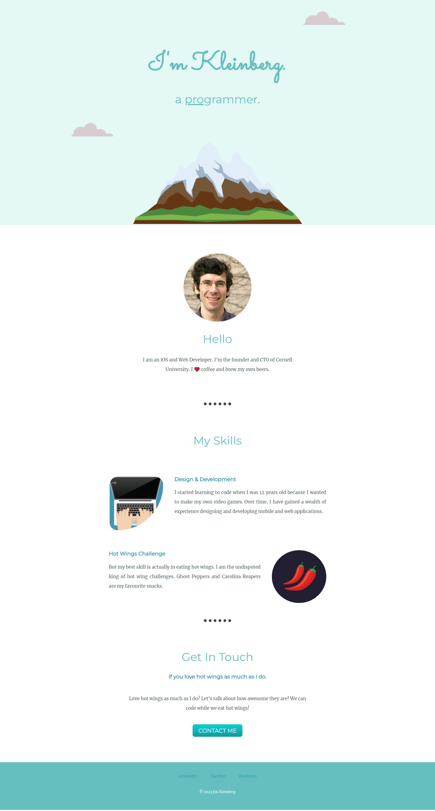

# Sample Portfolio Website

This is a simple portfolio website built using HTML and CSS. The website showcases the author's work and provides information about the author's skills and experience.

## Features

This website includes the following features:

* Introduction section with a brief summary and photo.
* Skills section with a list of author's skills.
* Contact section with a contact form and links to social media profiles.

## Technologies Used

The website was built using the following technologies:

* HTML
* CSS

## 🛠 Installation and Setup Instructions

1. git clone https://github.com/tawfik575/sample-portfolio-website-2.git
2. cd sample-portfolio-website-2
3. start index.html

## Contributing

This is a sample project and contributions are not necessary. However, if you would like to contribute to the project, please fork the repository and submit a pull request.

## License

This project is licensed under the MIT License. See the LICENSE file for more information.

## Contact

If you have any questions or comments about the project, please contact the project owner by sending an email at `tawfikbsmrstucse@gmail.com`.